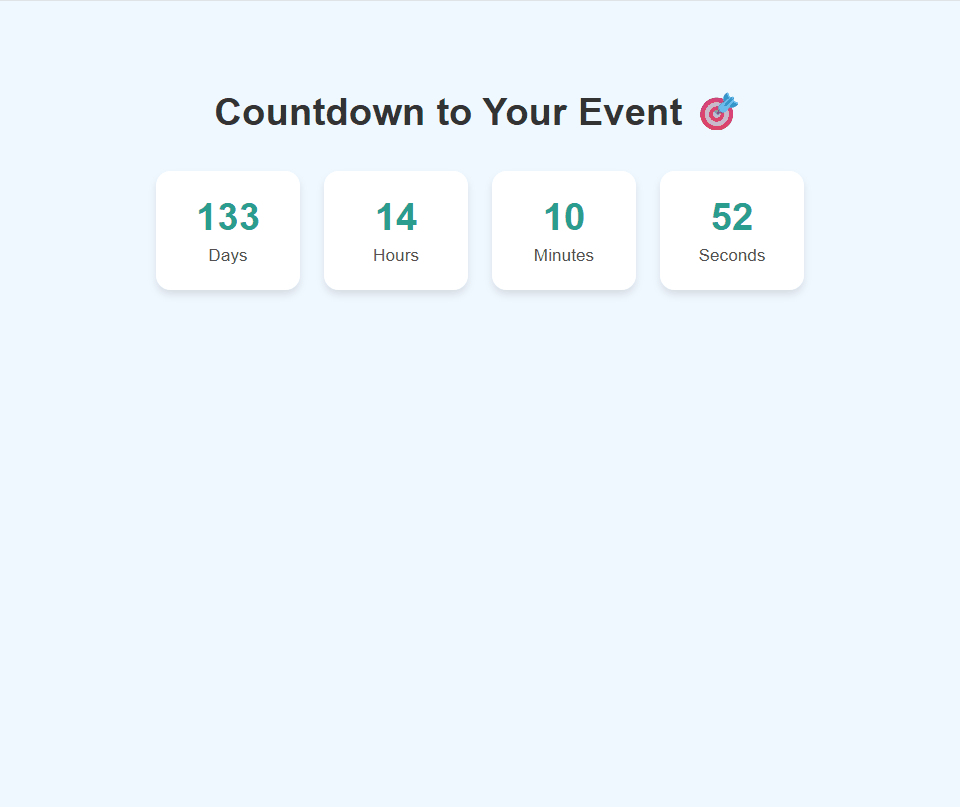
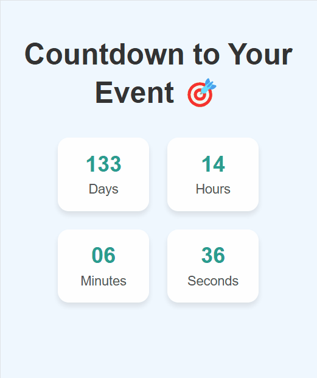

# 📅 Date Countdown
A lightweight and responsive date countdown web application built with HTML, CSS, and JavaScript.


## 🌐 Demo
Visit directly from your web browser:
[Date Countdown](https://rytvee.github.io/christmas-countdown/)


## ✨ Features
- 🕒  Live countdown to any selected date
- ⏳ Updates every second
- 📱 Fully responsive design for mobile and desktop


## 📸 Screenshots

**Desktop screen**



**Tablet screen**


**Mobile screen**




## 🛠 Technologies Used
-  — Markup structure
-  — Styling and layout
-  — Countdown logic and dynamic updates


## 📂 Project Structure
```
date-countdown/
│── index.html      # Main HTML page
│── style.css       # Styling
│── script.js       # Countdown logic
└── README.md       # Project documentation
```


## 🔧 How to Use
- Clone this repository:
```
git clone https://github.com/rytvee/date-countdown.git
```
- Open `index.html` in your browser.

- Watch the live countdown update in real-time.


## 📜 License
This project is licensed under the MIT License.

